# Socks Shop Microservices-based Application Deployment on Kubernetes using IaC

### Project Overview

The **Socks Shop** application is a widely recognized microservices-based e-commerce platform, often utilized as a reference for showcasing modern cloud-native technologies. This application is composed of several microservices, each dedicated to a specific function such as product catalog, shopping cart, and user authentication. Designed with scalability, resilience, and fault tolerance in mind, the Socks Shop application is an ideal candidate for deployment on Kubernetes.

This project focuses on deploying the Socks Shop application on a Kubernetes cluster using an **Infrastructure as Code (IaC)** approach. The key tasks in this project include:

* **Provisioning Infrastructure Resources** : Setting up the necessary infrastructure on AWS.
* **Deployment Pipeline** : Establishing a continuous deployment pipeline using GitHub Actions.
* **Monitoring** : Implementing monitoring solutions to track the performance and health of the application using Prometheus.
* **Logging** : Utilizing the ELK Stack for centralized logging.
* **Security** : Securing the infrastructure using Ansible.

The project employs a combination of tools and technologies, including **Terraform** for infrastructure provisioning, **GitHub Actions** for CI/CD pipeline automation, **Kubernetes** for container orchestration, **Helm** for package management, **Prometheus** for monitoring, **ELK Stack** for logging, and **Ansible** for enhancing security.

### Project Components

1. **Infrastructure Provisioning**
   Provisioning the required cloud resources on AWS using Terraform, ensuring a scalable and resilient environment for the Socks Shop application.
2. **Deployment Pipeline**
   Implementing a CI/CD pipeline using GitHub Actions to automate the deployment of the application to the Kubernetes cluster, enabling continuous integration and delivery.
3. **Monitoring**
   Setting up monitoring systems with Prometheus to track the performance, availability, and health of the microservices within the Socks Shop application.
4. **Logging**
   Utilizing the ELK Stack (Elasticsearch, Logstash, and Kibana) to centralize, process, and visualize logs from the microservices, aiding in troubleshooting and performance analysis.
5. **Security**
   Securing the infrastructure with Ansible, including setting up proper access controls, encrypting sensitive data, and ensuring the security of the Kubernetes cluster and associated resources.

### Project Requirements

To successfully complete this project, the following tools and services are required:

* **Terraform** : For provisioning infrastructure resources on AWS.
* **AWS Account** : To host the cloud infrastructure, including the Kubernetes cluster.
* **Kubernetes** : For container orchestration, managing the deployment and scaling of microservices.
* **Helm** : For managing Kubernetes applications as Helm charts.
* **Prometheus** : For monitoring the performance and health of the application and infrastructure.
* **ELK Stack (Elasticsearch, Logstash, Kibana)** : For logging, centralizing, and visualizing logs from the microservices.
* **Let's Encrypt** : For securing the application with SSL/TLS certificates.
* **Socks Shop Application** : The microservices-based e-commerce platform being deployed.

### Infrastructure Provisioning

Using Terraform, we will provision the necessary infrastructure resources on AWS, including VPCs, subnets, security groups, and an EKS cluster. This approach ensures a clear and reproducible infrastructure setup.

#### Prerequisites

Ensure that Terraform and AWS CLI are installed on your local machine. If not, you can follow the installation guides below:

* [AWS CLI Installation Guide](https://docs.aws.amazon.com/cli/latest/userguide/install-cliv2.html)
* [Terraform Download]()

#### Setup and Initialization

1. **Create a New Directory for Terraform Configuration Files**
   Start by creating a directory for the Terraform configuration files and navigating to it:

   ```bash
   mkdir Socks-Shop_Terraform
   cd Socks-Shop_Terraform
   ```
2. **Clone the Repository**
   Clone the repository containing the Terraform configuration files:

   ```bash
    git clone https://github.com/Ezekiel200483/SockShop-deployment.git
   cd Terraform
   ```
3. **Initialize the Terraform Project**
   Run the following command to initialize the Terraform project, which will download the necessary providers and set up the backend:

   ```bash
   terraform init
   ```
4. **Create an Execution Plan**
   Generate an execution plan to review the actions Terraform will take to provision your infrastructure:

   ```bash
   terraform plan
   ```
5. **Apply the Terraform Configuration**
   Apply the changes to provision the infrastructure. The `--auto-approve` flag can be added to avoid the prompt for confirmation:

   ```bash

   terraform apply --auto-approve


   ```

   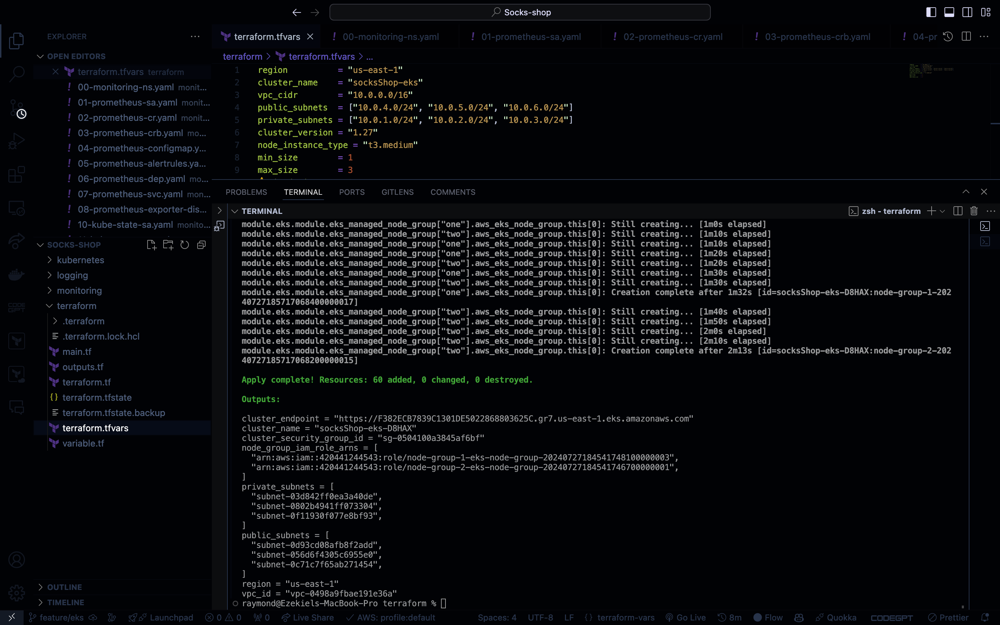Below is a screenshot of the EKS cluster being provisioned by Terraform:

   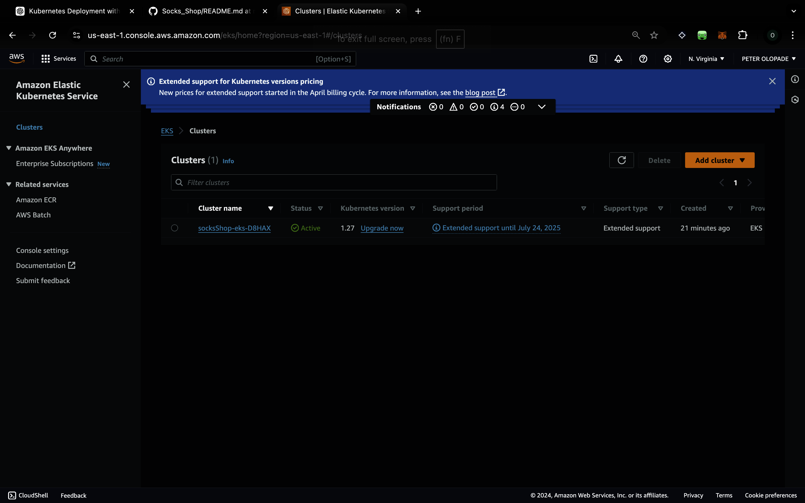

### Kubernetes Configuration

Once the infrastructure has been provisioned, you need to configure `kubectl` to connect to your EKS cluster. This allows you to manage the cluster directly from your local machine.

#### Configuring `kubectl`

Use the following command to configure `kubectl` to connect to the EKS cluster. This command specifies the region and the cluster name:

```bash
aws eks update-kubeconfig --name=socksShop-eks-D8HAX --region=us-east-1
```

After running this command, `kubectl` will be configured to communicate with your EKS cluster. You should see the output of the Terraform apply command, including the EKS cluster endpoint and the updated kubeconfig file.

#### Deploying the Application

With `kubectl` configured, you can now deploy the application to the EKS cluster using the following command:

```bash
kubectl apply -f kubernetes/deployment.yaml
```

This command applies the deployment manifests defined in the `deployment.yaml` file to the cluster, deploying the Socks Shop application and its associated resources.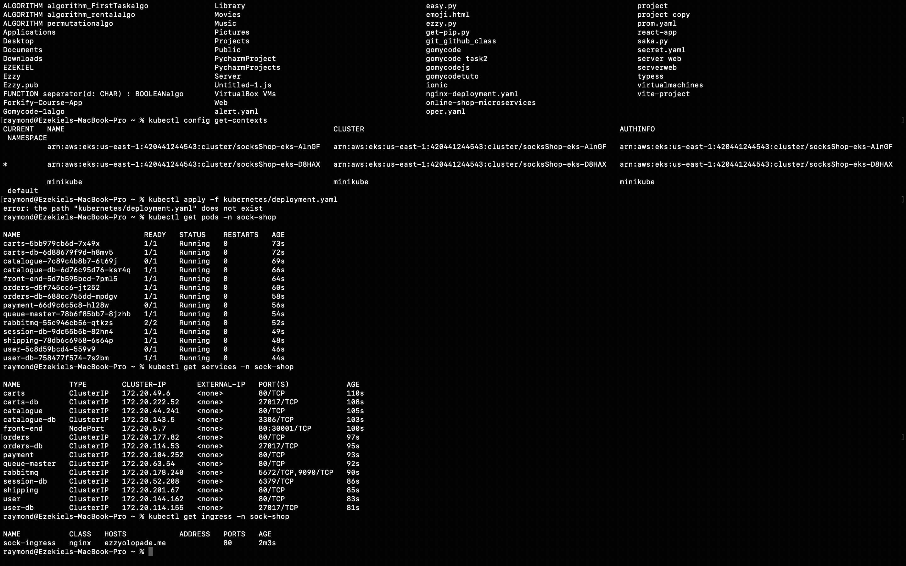

You can use the kubeconfig file to access the Kubernetes cluster and deploy the Socks Shop application.

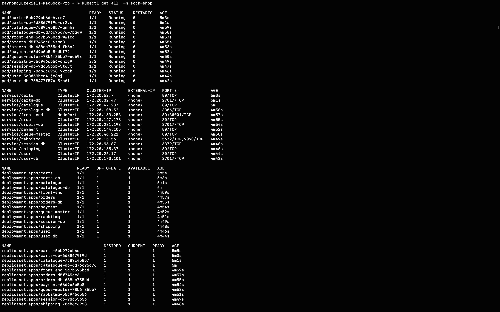

You can also use the following command to verify that the Socks Shop application is running on the Kubernetes cluster:

```bash
kubectl get all -A
```

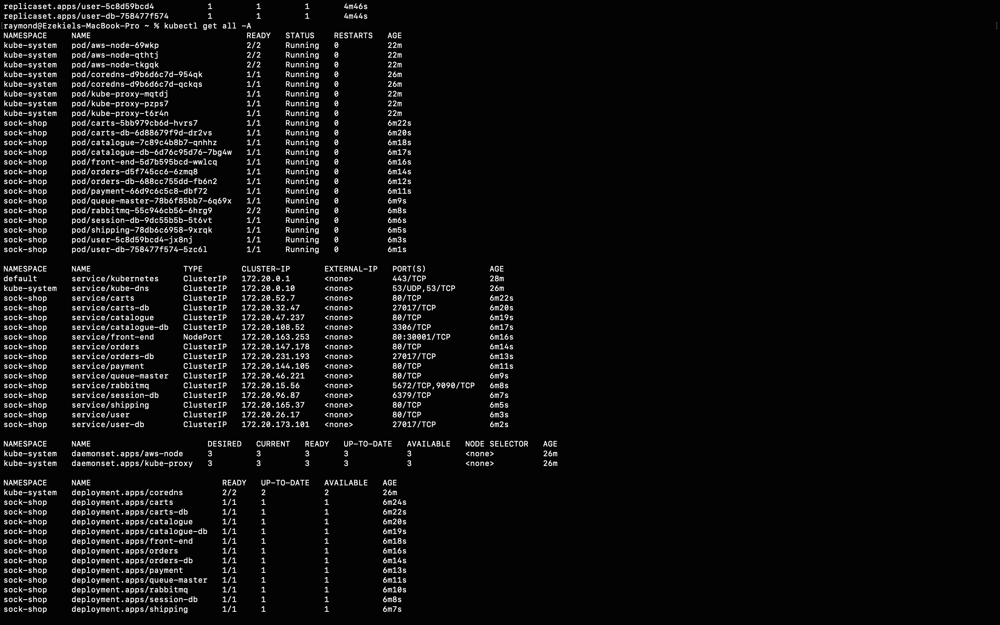

After we confirm that our pods are running, we can now test the application by port-forwarding the service to our local machine using the following command:

```bash
kubectl port-forward service/front-end -n sock-shop 30001:80
```

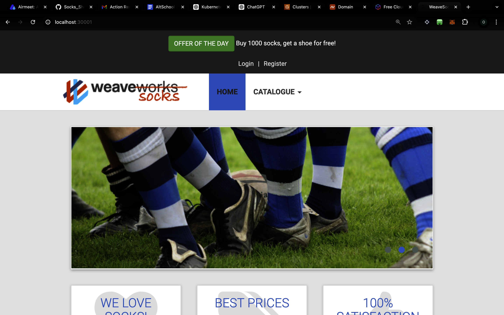

Since i can see the frontned with portforward, i was about to route the app to my domain name;

1. Install Nginx Ingress Controller

```bash
helm repo add ingress-nginx [https://kubernetes.github.io/ingress-nginx](https://kubernetes.github.io/ingress-nginx)
helm repo update
```

**2.Install the Nginx Ingress Controller using Helm** :


```bash
helm install ingress-nginx ingress-nginx/ingress-nginx --namespace ingress-nginx --create-namespace
```

3. **Update DNS Configuration**


Get the ELB DNS Name or IP


After the Ingress controller is running and has an external IP (Loadbalancer), get the DNS name or IP of the AWS ELB:

```bash
kubectl get services -o wide -n ingress-nginx
```

4. 

 **Update DNS Records in Namecheap** :

* Log in to your Namecheap account.
* Navigate to the "Domain List" and select your domain.
* Go to the "Advanced DNS" tab.
* **Update A Record for Root Domain** :
* **Type** : A
* **Host** : `@`
* **Value** : `<ELB External IP>`
* **TTL** : Automatic
* **Update CNAME Record for `www` Subdomain** :
* **Type** : CNAME
* **Host** : `www`
* **Value** : `<ELB DNS Name>`
* **TTL** : Automatic

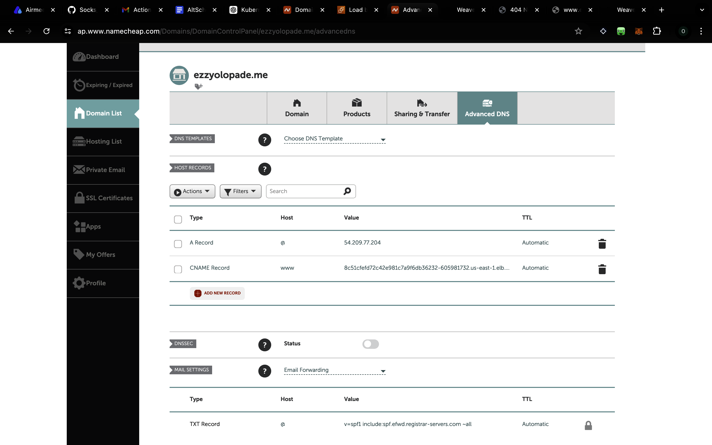

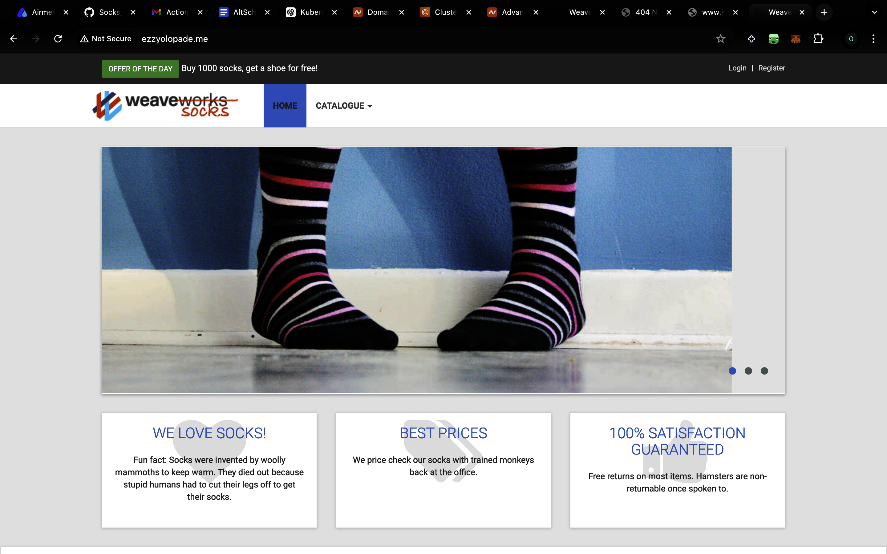

### Deployment Pipeline

The deployment pipeline for the Socks Shop application is configured using a GitHub Actions workflow file. This file defines the steps required to build and deploy the application, ensuring a seamless and automated deployment process.

#### Workflow Configuration

The GitHub Actions workflow file must be located in the root directory of the repository to be detected automatically by GitHub Actions. The workflow is triggered by any push to the main branch, initiating the following steps:

1. **Checkout Source Code** : The workflow starts by checking out the source code from the repository, ensuring that the latest version of the code is used in the build and deployment process.
2. **Build Docker Images** : Next, the Docker images for the Socks Shop application are built. These images package the application and its dependencies, making it ready for deployment.
3. **Deploy to Kubernetes** : Finally, the workflow deploys the Socks Shop application to the Kubernetes cluster using the `kubectl` command. This step ensures that the application is up and running on the cluster with the latest version of the code.

#### Continuous Deployment

The deployment pipeline is configured to run automatically whenever changes are pushed to the main branch of the repository. This continuous deployment approach ensures that the Socks Shop application is always up to date and running the latest version, with minimal manual intervention.

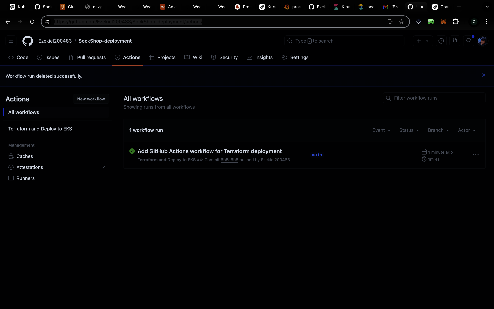


**Monitoring Setup**

To monitor the performance and health of the Socks Shop application, we will use Prometheus. This monitoring setup will include tracking key metrics such as request latency, error rate, and request volume. The Prometheus server will be configured to scrape these metrics from the Socks Shop application, storing them in a time-series database.

For visualizing the collected metrics, Grafana will be employed to create dashboards, providing an intuitive interface for monitoring the application's performance and health.

**Steps:**

1. Begin by creating the monitoring namespace using the `00-monitoring-ns.yaml` file:

```bash
kubectl create -f 00-monitoring-ns.yaml
```


 2.  

**Deployment Instructions**

To deploy Prometheus, simply apply all the Prometheus manifests (files numbered 01-10). These manifests can be applied in any order.


```bash
kubectl apply $(ls  *-prometheus-* .yaml | awk ' { print " -f " $1 } ')
```


3. The prometheus server will be exposed on Nodeport `31090` using the following command:

```bash
kubectl port-forward service/prometheus 31090:80 -n monitoring
```

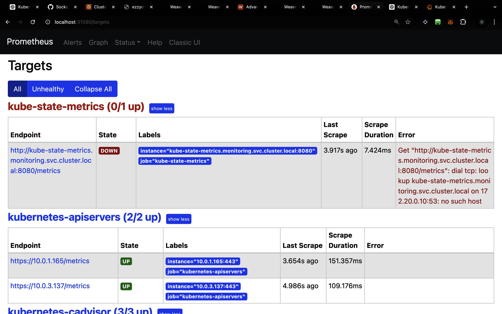

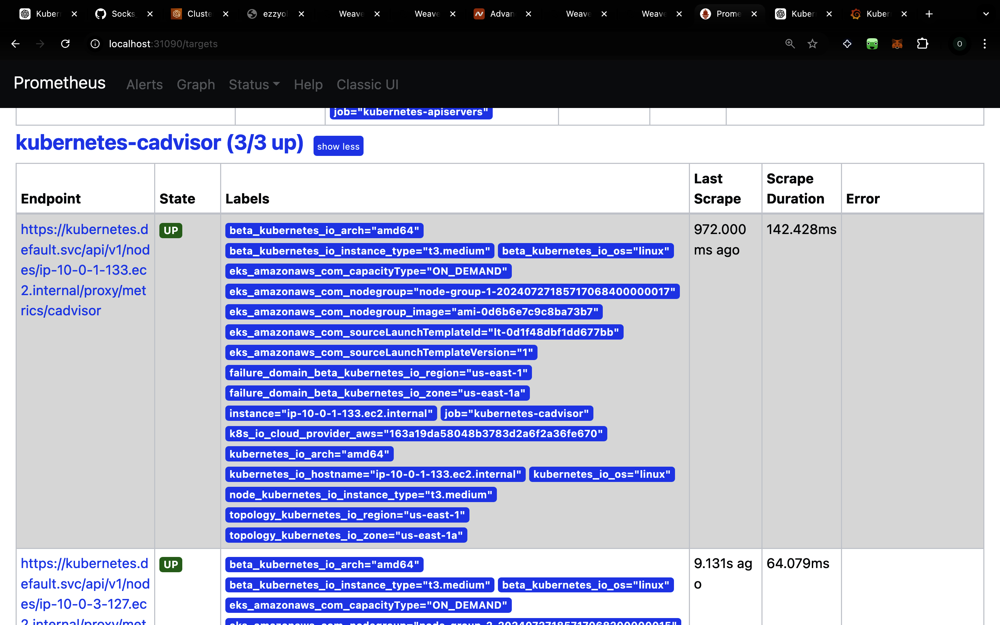


4. 

**Grafana Dashboard Import**

Once the Grafana pod is in the **Running** state, apply the `23-grafana-import-dash-batch.yaml` manifest to import the dashboards.


```bash
kubectl apply -f 23-grafana-import-dash-batch.yaml
```

5. Grafana will be exposed on the NodePort `31300` using the following command:

```bash
kubectl port-forward service/grafana 31300:3000 -n monitoring
```

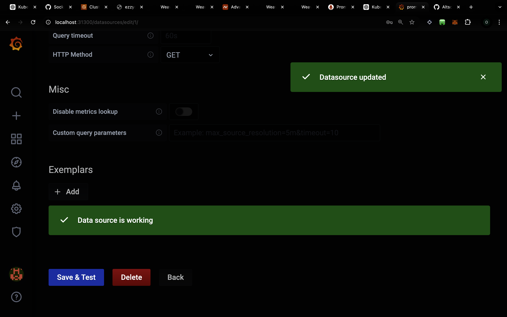

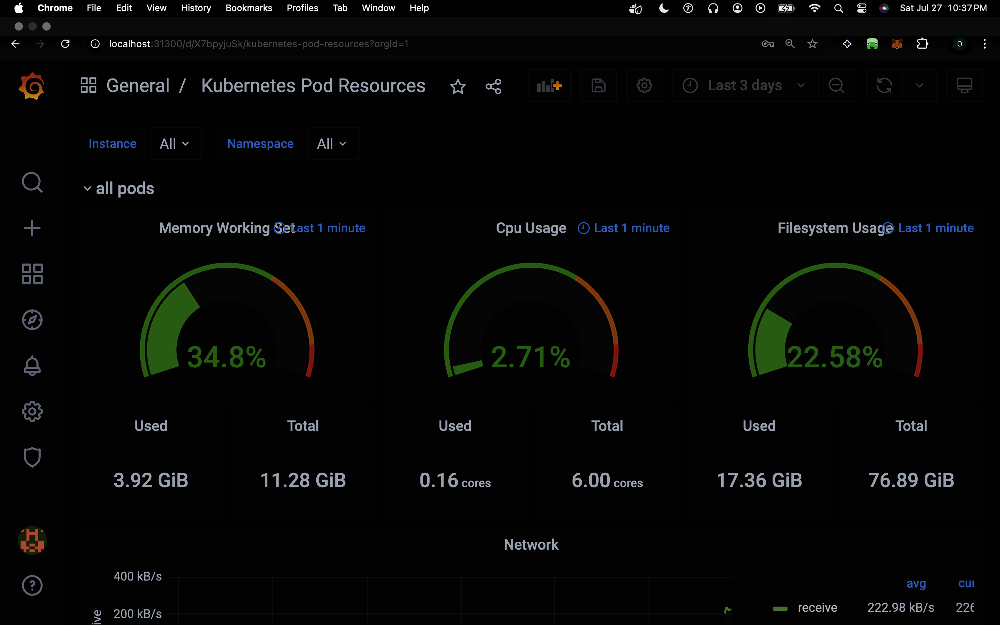

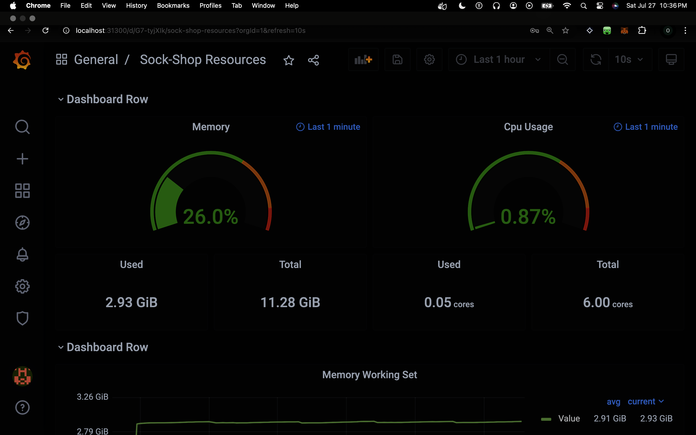

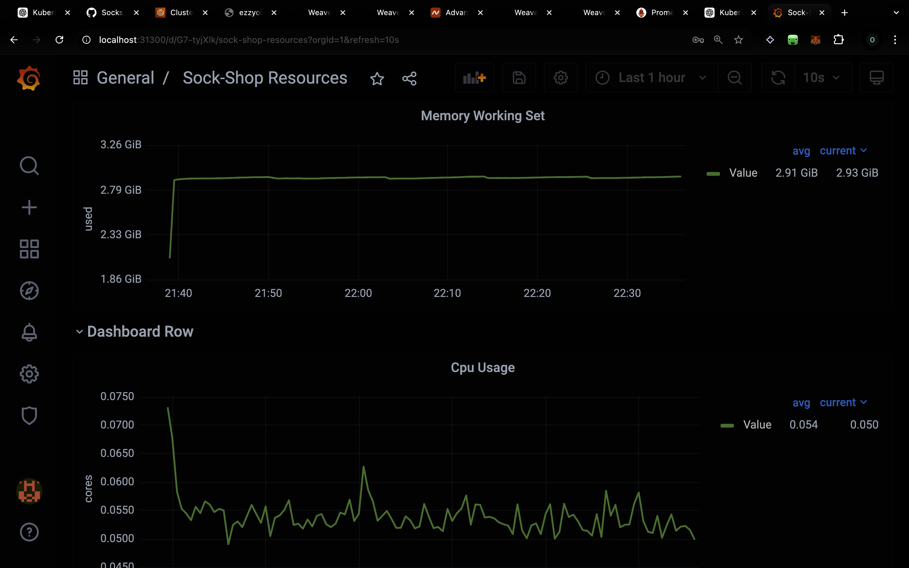


**Logging Setup**

We will utilize the ELK stack to collect and analyze logs from the Socks Shop application. The ELK stack comprises three open-source products — Elasticsearch, Logstash, and Kibana — all developed and maintained by Elastic. This stack is designed to collect, search, analyze, and visualize log data in real time.

Below is a screenshot showcasing the deployment of the logging system to our cluster:

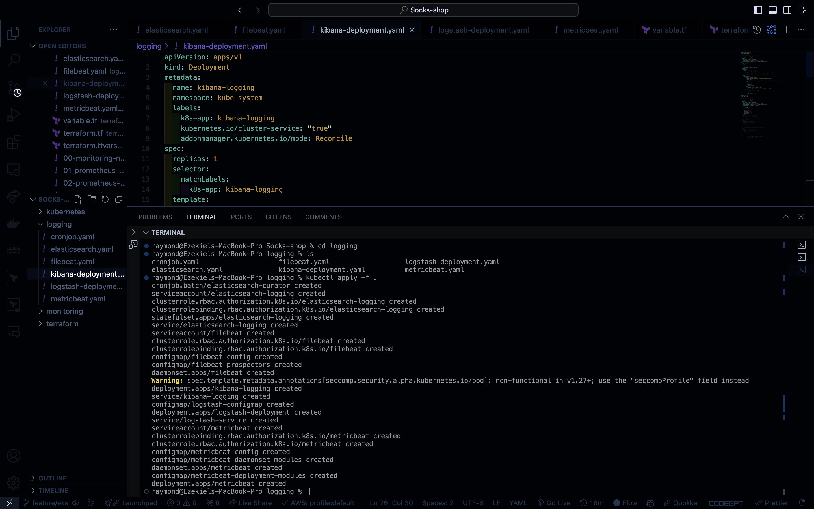

Verified running Pods:

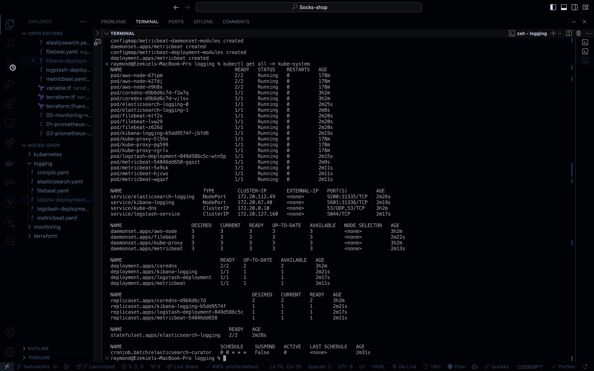


**Accessing Logging Services Locally**

After successfully deploying the logging services to our cluster, use the following command to port forward the service, allowing local access:

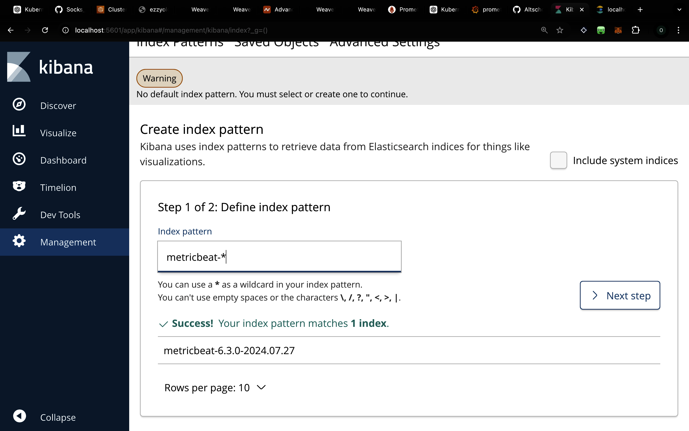

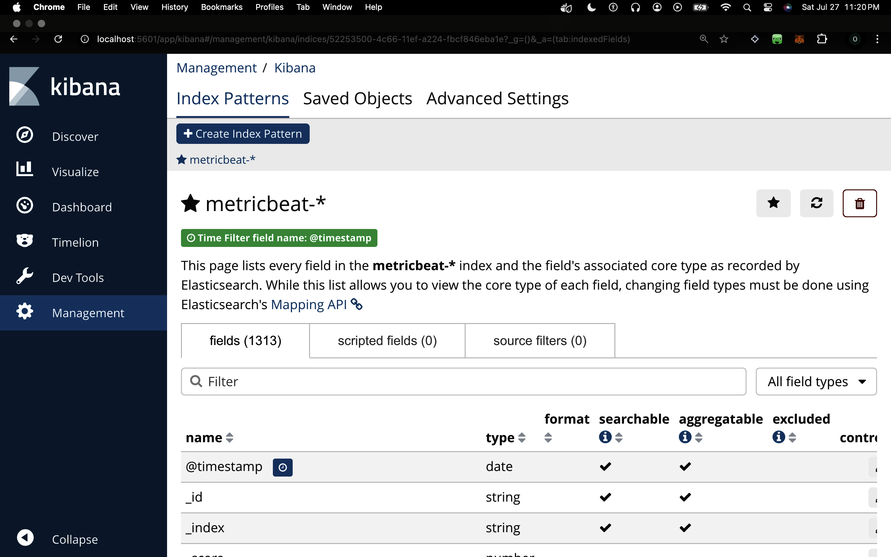

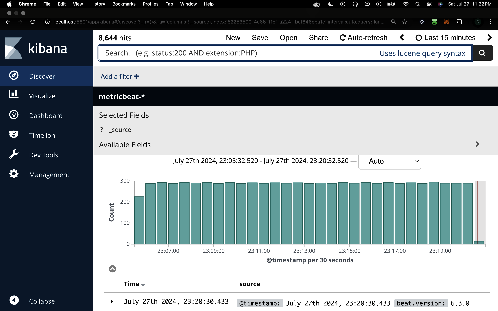

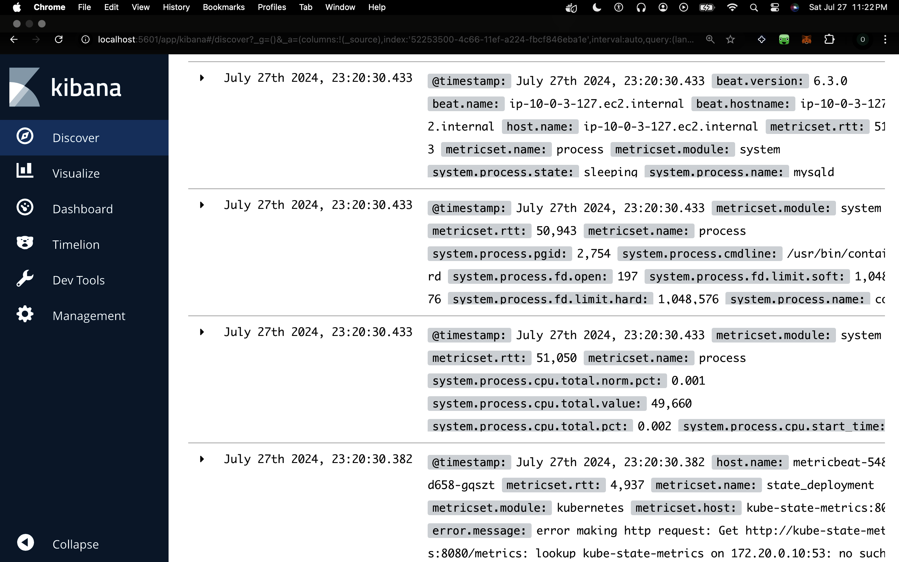

### Conclusion

The successful deployment of the Socks Shop application using Kubernetes and Infrastructure as Code not only demonstrates the power of modern cloud-native technologies but also provides a robust, scalable, and secure environment for microservices-based applications. This project serves as a comprehensive guide for deploying similar applications in production environments.
